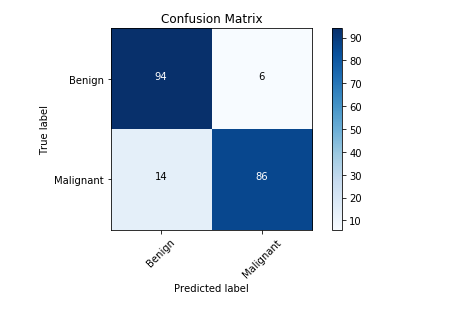

# Brain-Tumor-Detection

A fine-tune VGG16 Brain Tumor classifier with keras.

# Data Augmentation

Data augmentation occurs when you create new data based on modifications of your existing data. 

Before augmenting, the dataset consisted of 96 positive and 96 negative MRI images that is total 192 images. Since the dataset was small data augmentation was performed. These 96 images were splitted as 64, 20, 10 for training, validation and testing in the train, valid and test directory respectively for both positive and negative example images.

We will then generate 10 samples of augmented images from each of this image. This will result into generation of 960 positive and 960 negative i.e total 1,920 example images.

The augmented data is stored in the augmented_data directory.

# Data split

The data was split in the following ways:

- 1280 images for training.

- 440 images for validation.

- 200 images for testing.

# Build the model 

Keras has a library of pre-trained models available for you to be able to pull down for the purposes of fine-tuning.

Importing VGG16 model.

> keras.applications.vgg16.VGG16()

# Train the model.

The model was trained for 30 epochs.

# Confusion Matrix

# Results

Accuracy of test set : 90%

F1 score of test set : 93%
